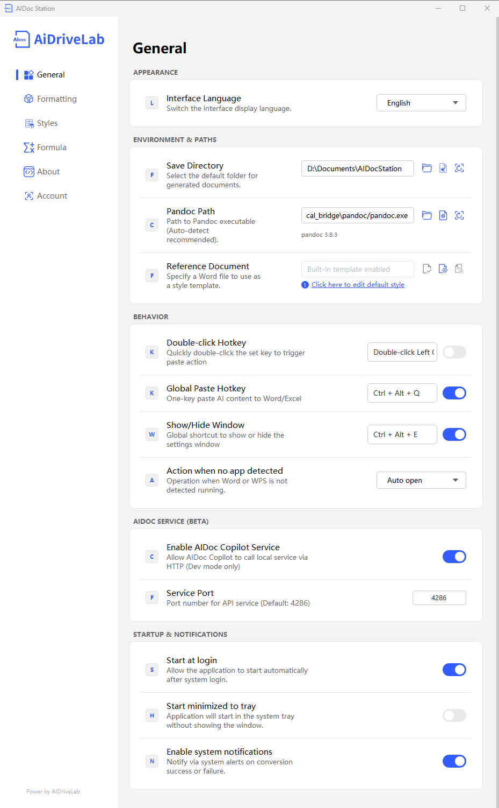

# General Settings Guide

This document provides a detailed introduction to the configuration methods and functions of various items in the AiDocStation General Settings interface.

---

## 1. Application Appearance

### Interface Language
- **Description**: Switch the display language of the software interface. Supports Chinese/English.
- **How to Operate**: Click the dropdown box and select "简体中文" (Simplified Chinese) or "English".
- **Default Config**: Follows system language.

---

## 2. Environment & Dependencies

### File Save Directory
- **Description**: Set the final storage path for generated Word/Excel documents.
- **How to Operate**:
  1. Click the folder icon on the right side of the input box to select the target directory.
  2. Or directly type the full path in the input box.
- **Default Config**: `User Documents Directory\AiDocStation`.

### Pandoc Path
- **Description**: Specify the location of the Pandoc executable used for document format conversion. Automatic detection is recommended.
- **How to Operate**:
  1. Click the folder icon on the right side of the input box to locate `pandoc.exe`.
  2. Or directly type the full path in the input box.
- **Default Config**: `\pandoc\pandoc.exe` (Supports detection of Pandoc version information).

### Reference Document
- **Description**: Specify a Word file as a style template. Newly generated documents will inherit its styles (e.g., fonts, paragraphs, heading formats, etc.).
- **How to Operate**:
  1. Click the folder icon on the right side of the input box to select a Word document as a template.
  2. Click the link "Click here to modify the default template style" to edit the built-in template.
- **Default Config**: Disabled. Built-in and custom templates can be selected as needed.

---

## 3. Interaction Behavior

### Double-Click Fast Paste Key
- **Description**: Quickly double-click the set key to perform a fast content insertion.
- **How to Operate**:
  1. Turn on the switch on the right.
  2. Click the input box and press the key you want to set (e.g., Left Ctrl).
- **Default Config**: Double-click Left Ctrl (Effective only after enabling).

### Global Paste Hotkey
- **Description**: One-click paste AI content into Word/Excel without manual copying.
- **How to Operate**:
  1. Ensure the switch on the right is turned ON.
  2. Click the input box to customize the hotkey combination.
- **Default Config**: `Ctrl + Alt + Q` (Enabled).

### Show and Hide Window
- **Description**: Globally show or hide the AiDocStation settings window for quick access.
- **How to Operate**:
  1. Ensure the switch on the right is turned ON.
  2. Click the input box to customize the hotkey combination.
- **Default Config**: `Ctrl + Alt + E` (Enabled).

### Action When No App is Running
- **Description**: Preset operation performed by the software when no running Word or WPS instance is detected.
- **How to Operate**: Click the dropdown box and select "Auto Open" or other options.
- **Default Config**: Auto open Word or WPS.

---

## 4. AIDOC Services (BETA)

### Enable AIDOC Copilot Service
- **Description**: Allows AIDOC Copilot to call local services via HTTP. Available only in development mode.
- **How to Operate**: Turn on the switch on the right.
- **Default Config**: Disabled.

### Service Port
- **Description**: Set the port number the API service listens on for communication with AIDOC Copilot.
- **How to Operate**: Type the port number in the input box. Default is 4286.
- **Default Config**: 4286.

---

## 5. Startup & Notifications

### Launch at Startup
- **Description**: Allows the program to run automatically with Windows startup.
- **How to Operate**: Turn on the switch on the right.
- **Current Config**: Enabled.

### Minimize to Tray at Startup
- **Description**: Does not show the main window after startup; runs directly in the system tray to save desktop space.
- **How to Operate**: Turn on the switch on the right.
- **Default Config**: Disabled.

### Enable System Notifications
- **Description**: Informs the user through a pop-up in the lower-right corner of the system when a document conversion succeeds or fails.
- **How to Operate**: Turn on the switch on the right.
- **Default Config**: Enabled.

---

> 📸 General Settings Interface: 
> *Note: General Settings interface includes File Save Directory, Pandoc Path, Reference Document, Fast Paste Key, Hotkeys, App Actions, AIDOC Services, Startup, and Notification settings.*