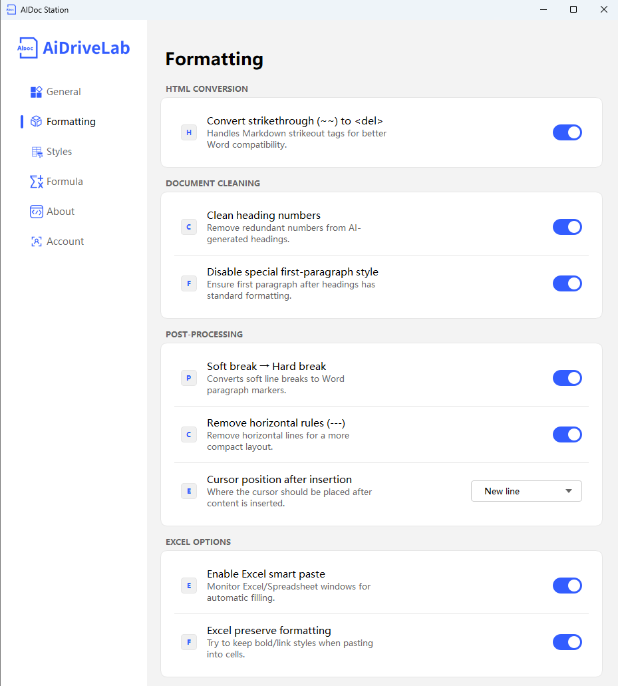

# Format Processing Engine Guide

This document provides a detailed introduction to the configuration methods and functions of various items in the AiDocStation Format Processing Engine interface.

---

## 1. HTML Conversion Options

### Convert Strikethrough (~~) to `<del>`
- **Description**: Provides better Word compatibility for Markdown strikethrough syntax (`~~content~~`) by converting it to HTML `<del>` tags.
- **How to Operate**: Turn on the switch on the right.
- **Default Config**: Enabled.

---

## 2. Document Cleaning

### Clean Heading Numbers
- **Description**: Automatically removes redundant heading numbers generated by AI (e.g., `1. 2.`), making the document structure clearer and more standardized.
- **How to Operate**: Turn on the switch on the right.
- **Default Config**: Enabled.

### Disable Special Formatting for First Paragraph
- **Description**: Ensures the first paragraph after a heading has standard indentation formatting, avoiding issues such as no indentation for the first line.
- **How to Operate**: Turn on the switch on the right.
- **Default Config**: Enabled.

---

## 3. Post-Processing

### Soft Wrap to Hard Wrap
- **Description**: Converts soft wraps in Markdown (a single newline) into Word paragraph marks (hard wraps) to ensure accurate paragraph structure.
- **How to Operate**: Turn on the switch on the right.
- **Default Config**: Enabled.

### Delete Dividers (---)
- **Description**: Automatically removes horizontal dividers (`---`) from the document to make the layout more compact and aesthetically pleasing.
- **How to Operate**: Turn on the switch on the right.
- **Default Config**: Enabled.

### Cursor Position After Insertion
- **Description**: Sets the position where the cursor stops in the document after content insertion is complete.
- **How to Operate**: Click the dropdown box and select "Newline" or other options.
- **Default Config**: Newline.

---

## 4. EXCEL Options

### Enable Excel Smart Fill
- **Description**: Monitors the Excel window and automatically fills content into the active cell without manual positioning or pasting.
- **How to Operate**: Turn on the switch on the right.
- **Default Config**: Enabled.

### Preserve Excel Formatting
- **Description**: Attempts to preserve rich text formats such as bold, links, and line breaks during pasting to ensure content integrity.
- **How to Operate**: Turn on the switch on the right.
- **Default Config**: Enabled.

---
> 📸 Format Processing Interface: 
> *Note: Format Processing interface includes HTML Conversion, Document Cleaning, Post-Processing, and EXCEL options.*