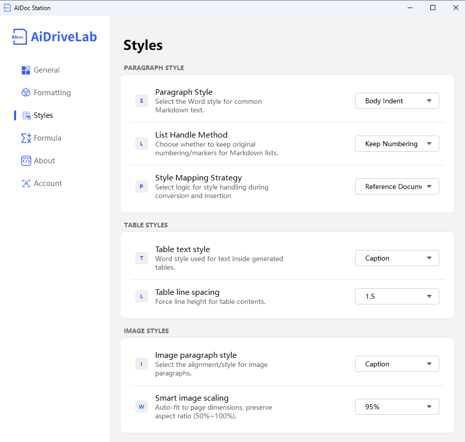

# Style Mapping Standards Guide

This document provides a detailed introduction to the configuration methods and functions of various items in the AiDocStation Style Mapping interface.

---

## 1. Paragraph Body Style

### Paragraph Body Style
- **Description**: Specifies a Word style for regular Markdown text to control typesetting effects like font, indentation, and line spacing for the body text.
- **How to Operate**: Click the dropdown box and select a preset Word style (e.g., "Body Indent", "Body No Indent", etc.).
- **Current Config**: Body Indent.

### List Handling Strategy
- **Description**: Controls whether to preserve native numbering or bullet points when inserting Markdown lists to ensure consistency in list structure.
- **How to Operate**: Click the dropdown box and select a strategy like "Preserve List Numbering" or "Remove Numbering".
- **Current Config**: Preserve List Numbering.

### Style Mapping Strategy
- **Description**: Selects the style processing logic during Pandoc conversion and Word insertion, determining the priority of style inheritance.
- **How to Operate**: Click the dropdown box and select a strategy like "Native Reference Document" or "Built-in Template".
- **Current Config**: Native Reference Document.

---

## 2. Table Style

### Table Text Style
- **Description**: Specifies the Word style used for text within table cells to unify the typesetting style of text inside tables.
- **How to Operate**: Click the dropdown box and select a preset Word style (e.g., "Caption", "Table Body", etc.).
- **Current Config**: Caption.

### Table Line Spacing Optimization
- **Description**: Forcibly sets the line spacing for table content to avoid layout chaos caused by too much content and improve table readability.
- **How to Operate**: Click the dropdown box and select a preset line spacing value (e.g., 1.0, 1.5, 2.0) or enter a custom value.
- **Current Config**: 1.5.

---

## 3. Image Style

### Image Paragraph Style
- **Description**: Specifies a style (e.g., centered, caption) for the paragraph where the image is located to control the alignment and caption format in the document.
- **How to Operate**: Click the dropdown box and select a preset Word style (e.g., "Caption", "Center Alignment", etc.).
- **Current Config**: Caption.

### Smart Image Scaling
- **Description**: Automatically adapts to page size while maintaining the image aspect ratio. Scaling range is 50%~100% to avoid layout issues caused by images being too large or too small.
- **How to Operate**: Click the dropdown box and select a preset scaling ratio (e.g., 75%, 95%) or enter a custom value.
- **Current Config**: 95%.

---

> 📸 Style Mapping Interface: 
> *Note: Style Mapping interface includes Paragraph Body Style, List Handling, Mapping Strategies, Table Style, and Image Style settings.*