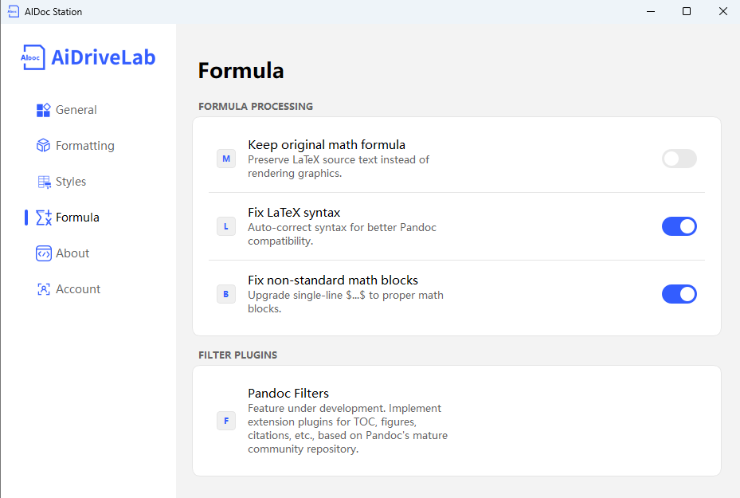

# Formula Conversion Standards

This document provides a detailed introduction to the configuration methods and functions of various items in the AiDocStation Formula Conversion settings interface.

---

## 1. Formula Processing

### Preserve Original Formula Text
- **Description**: Outputs LaTeX source code instead of rendering formulas as images or objects, facilitating subsequent editing and secondary processing.
- **How to Operate**: Turn on the switch on the right.
- **Current Config**: Disabled.

### Fix LaTeX Syntax Compatibility
- **Description**: Automatically corrects non-standard LaTeX symbols to adapt to Pandoc conversion, avoiding formula parsing errors.
- **How to Operate**: Turn on the switch on the right.
- **Current Config**: Enabled.

### Fix Single-Line Formula Blocks
- **Description**: Converts single-line `$ ... $` format formulas into standard mathematical formula blocks to ensure correct rendering in target formats like Word.
- **How to Operate**: Turn on the switch on the right.
- **Current Config**: Enabled.

---

## 2. FILTER Plugins

### Pandoc Filters (Lua)
- **Description**: A feature currently under development. Based on mature Pandoc community repositories, it will allow extension of plugins for table of contents, charts, citation formats, etc.
- **How to Operate**: This feature does not yet have open configuration options. Future versions will support custom Lua scripts.
- **Current Config**: Under Development.

---

> 📸 Formula Conversion Interface: 
> *Note: Formula Conversion interface includes Preserve Original Text, LaTeX Syntax Compatibility Fix, Single-Line Block Fix, and Pandoc Filters.*