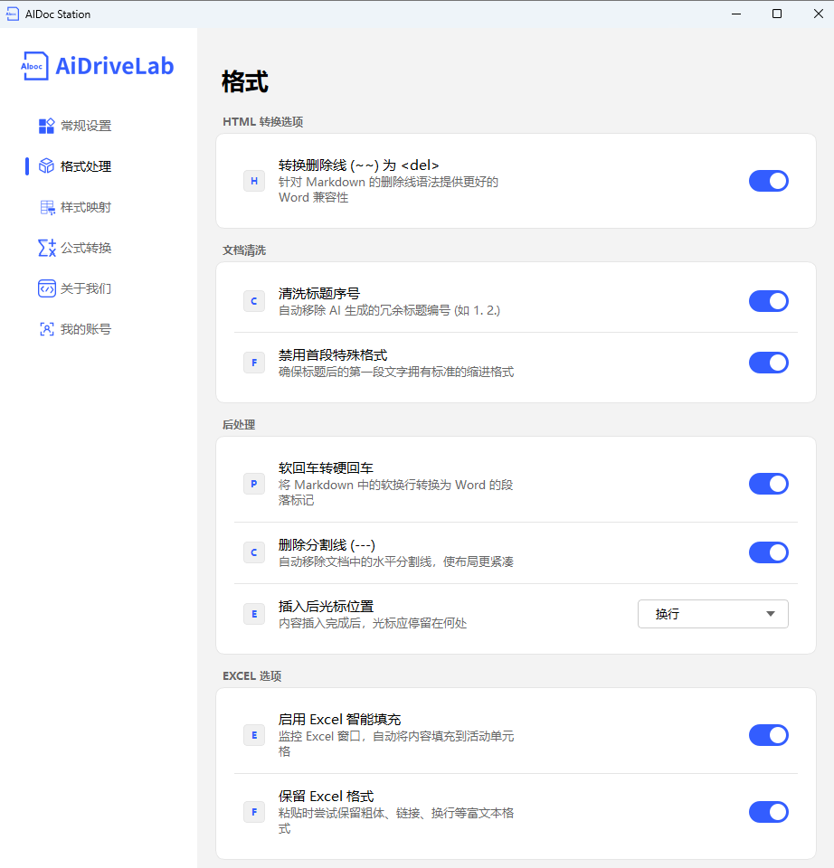

# 格式处理引擎设置指南

本文档详细介绍 AiDocStation 格式处理引擎中各项功能的配置方法与作用。

---

## 一、HTML 转换项

### 转换删除线 (~~) 为 `<del>`
- **功能描述**：针对 Markdown 的删除线语法（`~~内容~~`）提供更好的 Word 兼容性，将其转换为 HTML `<del>` 标签。
- **操作方式**：开启右侧开关。
- **默认配置**：已启用。

---

## 二、文档清洗

### 清洗标题序号
- **功能描述**：自动移除 AI 生成的冗余标题编号（如 `1. 2.`），使文档结构更清晰规范。
- **操作方式**：开启右侧开关。
- **默认配置**：已启用。

### 禁用首段特殊格式
- **功能描述**：确保标题后的第一段文字拥有标准的缩进格式，避免出现首行无缩进等排版问题。
- **操作方式**：开启右侧开关。
- **默认配置**：已启用。

---

## 三、后处理

### 软回车变硬回车
- **功能描述**：将 Markdown 中的软换行（单个换行符）转换为 Word 的段落标记（硬回车），保证段落结构准确。
- **操作方式**：开启右侧开关。
- **默认配置**：已启用。

### 删除分割线 (---)
- **功能描述**：自动移除文档中的水平分割线（`---`），使布局更紧凑美观。
- **操作方式**：开启右侧开关。
- **默认配置**：已启用。

### 插入后光标位置
- **功能描述**：设置内容插入完成后，光标在文档中的停留位置，方便后续操作。
- **操作方式**：点击下拉框，选择“换行”或其他选项。
- **默认配置**：换行。

---

## 四、EXCEL 选项

### 启用 Excel 智能填充
- **功能描述**：监控 Excel 窗口，自动将内容填充到活动单元格，无需手动定位粘贴位置。
- **操作方式**：开启右侧开关。
- **默认配置**：已启用。

### 保留 Excel 格式
- **功能描述**：粘贴时尝试保留粗体、链接、换行等富文本格式，确保内容样式完整。
- **操作方式**：开启右侧开关。
- **默认配置**：已启用。

---
> 📸 格式处理设置界面：
> *说明：格式处理设置界面，包含 HTML 转换项、文档清洗、后处理、EXCEL 选项等设置项*