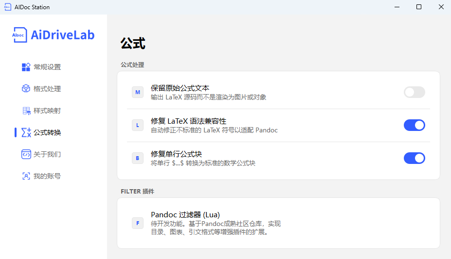

# 公式转换规范

本文档详细介绍 AiDocStation 公式转换设置界面中各项功能的配置方法与作用。

---

## 一、公式处理

### 保留原始公式文本
- **功能描述**：输出 LaTeX 源码，而非将公式渲染为图片或对象，便于后续编辑和二次处理。
- **操作方式**：开启右侧开关。
- **当前配置**：未启用。

### 修复 LaTeX 语法兼容性
- **功能描述**：自动修正不标准的 LaTeX 符号，以适配 Pandoc 转换，避免公式解析错误。
- **操作方式**：开启右侧开关。
- **当前配置**：已启用。

### 修复单行公式块
- **功能描述**：将单行 `$...$` 格式的公式转换为标准的数学公式块，确保在 Word 等目标格式中正确渲染。
- **操作方式**：开启右侧开关。
- **当前配置**：已启用。

---

## 二、FILTER 插件

### Pandoc 过滤器 (Lua)
- **功能描述**：待开发功能，基于 Pandoc 成熟社区仓库，可实现目录、图表、引文格式等增强插件的扩展。
- **操作方式**：该功能暂未开放配置选项，后续版本将支持自定义 Lua 脚本。
- **当前配置**：待开发。

---

> 📸 公式转换设置界面：
> *说明：公式转换设置界面，包含保留原始公式文本、修复 LaTeX 语法兼容性、修复单行公式块、Pandoc 过滤器等设置项*