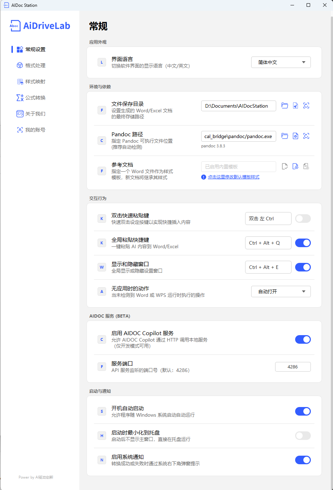

# 常规设置指南

本文档详细介绍 AiDocStation 常规设置界面中各项功能的配置方法与作用。

---

## 一、应用外观

### 界面语言
- **功能描述**：切换软件界面的显示语言，支持中文/英文。
- **操作方式**：点击下拉框，选择“简体中文”或“English”。
- **默认配置**：跟随系统语言。

---

## 二、环境与依赖

### 文件保存目录
- **功能描述**：设置生成的 Word/Excel 文档的最终存储路径。
- **操作方式**：
  1. 点击输入框右侧的文件夹图标，选择目标目录。
  2. 或直接在输入框中输入完整路径。
- **默认配置**：`用户文档目录\AiDocStation`。

### Pandoc 路径
- **功能描述**：指定 Pandoc 可执行文件位置，用于文档格式转换。推荐使用自动检测功能。
- **操作方式**：
  1. 点击输入框右侧的文件夹图标，定位 `pandoc.exe`。
  2. 或直接在输入框中输入完整路径。
- **默认配置**：`\pandoc\pandoc.exe`（支持检测Pandoc版本信息）。

### 参考文档
- **功能描述**：指定一个 Word 文件作为样式模板，新生成的文档将继承其样式（如字体、段落、标题格式等）。
- **操作方式**：
  1. 点击输入框右侧的文件夹图标，选择一个 Word 文档作为模板。
  2. 点击“点击这里修改默认模板样式”链接，可编辑内置模板。
- **默认配置**：禁用模板，可根据需要选择内置模板和自定义模板。

---

## 三、交互行为

### 双击快速粘贴键
- **功能描述**：快速双击设定的按键，即可实现快速插入内容。
- **操作方式**：
  1. 开启右侧开关。
  2. 点击输入框，按下想要设置的按键（如左 Ctrl）。
- **默认配置**：双击左 Ctrl（需启用后生效）。

### 全局粘贴快捷键
- **功能描述**：一键将 Ai 内容粘贴到 Word/Excel 中，无需手动复制。
- **操作方式**：
  1. 确保右侧开关为开启状态。
  2. 可点击输入框，自定义快捷键组合。
- **默认配置**：`Ctrl + Alt + Q`（功能已启用）。

### 显示和隐藏窗口
- **功能描述**：全局显示或隐藏 AiDocStation 设置窗口，方便快速调出。
- **操作方式**：
  1. 确保右侧开关为开启状态。
  2. 可点击输入框，自定义快捷键组合。
- **默认配置**：`Ctrl + Alt + E`（功能已启用）。

### 无应用时的动作
- **功能描述**：当未检测到 Word 或 WPS 运行时，软件执行的预设操作。
- **操作方式**：点击下拉框，选择“自动打开”或其他选项。
- **默认配置**：自动打开 Word 或 WPS。

---

## 四、AIDOC 服务 (BETA)

### 启用 AIDOC Copilot 服务
- **功能描述**：允许 AIDOC Copilot 通过 HTTP 调用本地服务，仅在开发模式下可用。
- **操作方式**：开启右侧开关。
- **默认配置**：未启用。

### 服务端口
- **功能描述**：设置 API 服务监听的端口号，用于与 AIDOC Copilot 通信。
- **操作方式**：在输入框中输入端口号，默认值为 4286。
- **默认配置**：4286。

---

## 五、启动与通知

### 开机自动启动
- **功能描述**：允许程序随 Windows 系统启动自动运行。
- **操作方式**：开启右侧开关。
- **当前配置**：已启用。

### 启动时最小化到托盘
- **功能描述**：启动后不显示主窗口，直接在系统托盘运行，节省桌面空间。
- **操作方式**：开启右侧开关。
- **默认配置**：未启用。

### 启用系统通知
- **功能描述**：在文档转换成功或失败时，通过系统右下角弹窗提示用户。
- **操作方式**：开启右侧开关。
- **默认配置**：已启用。

---

> 📸 常规设置界面：
> *说明：常规设置界面，包含文件保存目录、Pandoc 路径、参考文档、双击快速粘贴键、全局粘贴快捷键、显示和隐藏窗口、无应用时的动作、AIDOC 服务、启动与通知等设置项*